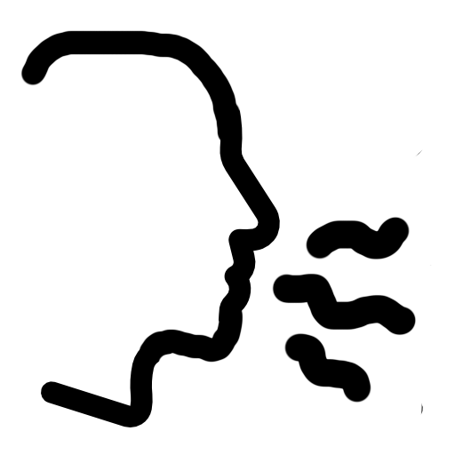
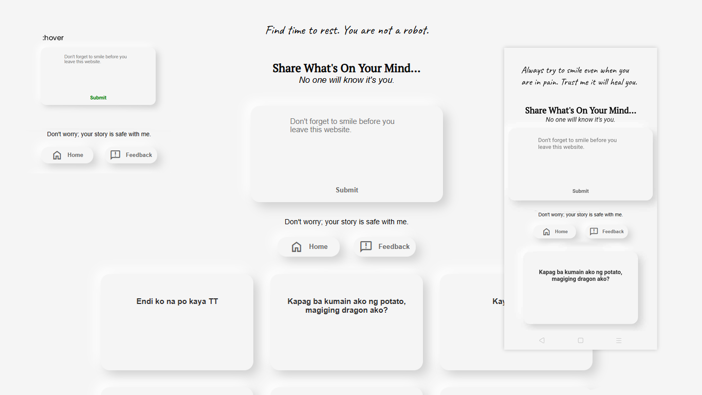
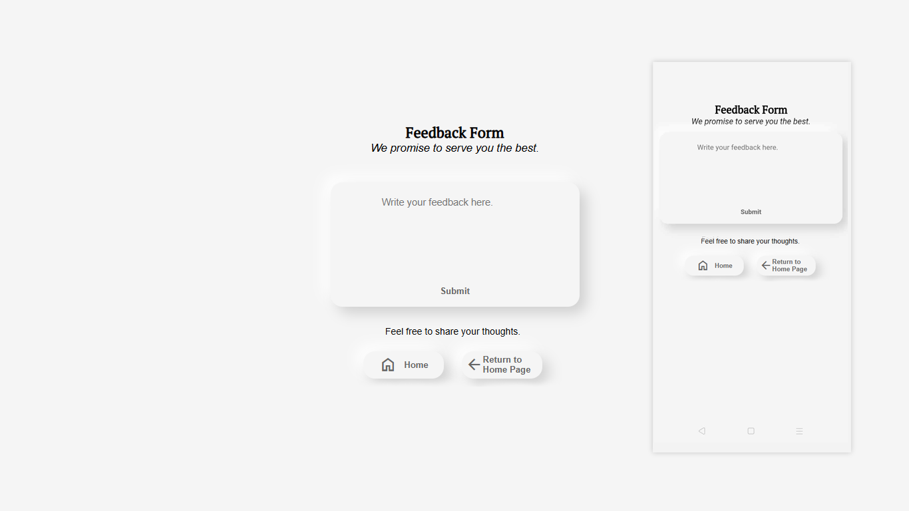

# **TALK**

Talk is a platform designed for users to share their rants, stories, or thoughts anonymously. It provides a safe space for expression without the fear of judgment or repercussions.

No individual reactions were included to prevent users from feeling ignored, and comments or replies were disabled to avoid potential hate speech.

**Live Demo**: [Talk Platform](https://talk-official.onrender.com/)  
You may experience some lag due to the website being hosted on a free server.

## Developer
James Michael D. Magnaye 
CS 3102 | IT 321 - Human-Computer Interaction

## Features
The home page demonstrates emotional design with calming visuals, motivational prompts, and a clean, user-friendly layout. It fosters trust and emotional engagement through anonymity and subtle feedback mechanisms. Navigation is intuitive, with easy access to all main features without unnecessary steps, ensuring a smooth and direct user experience. The responsive design ensures consistent usability across devices.

The feedback page promotes emotional engagement by providing a safe space for users to share their thoughts. The clean, minimalistic design encourages user participation, while subtle feedback mechanisms like success messages enhance the experience. The page is fully responsive, ensuring accessibility and usability across different devices.

## Technologies Used
- **Node.js**: Backend development platform.
- **HTML**: Structure of web pages.
- **CSS**: Styling for web pages.
- **JavaScript**: Frontend interactivity and functionality.
