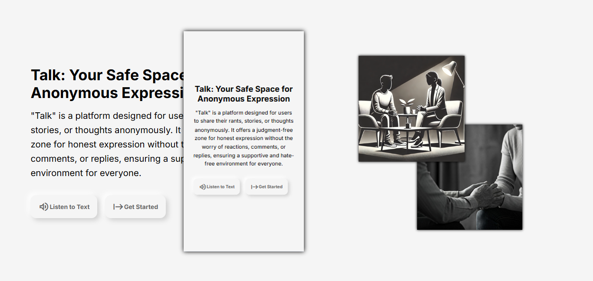

## Developer
[22-02172] James Michael D. Magnaye 
CS 3102 | IT 321 - Human-Computer Interaction

# **TALK**

Talk is a platform designed for users to share their rants, stories, or thoughts anonymously. It provides a safe space for expression without the fear of judgment or repercussions.

To ensure a positive environment, there are no individual reactions or comments on posts, preventing users from feeling ignored or encountering hate speech.

The platform incorporates Neumorphism design, which uses gentle shapes, soft shadows, and tactile elements to create a sense of comfort, sophistication, and interactivity. This design fosters a modern, intuitive, and engaging user experience.

**Live Demo**: [Talk Platform](https://talk-official.onrender.com/)  
You may experience some lag due to the website being hosted on a free server.

## Features
The landing page serves as the introduction to the Talk platform. It is designed to engage users immediately and explain the purpose of the platform in an inviting, welcoming way. It provides an overview of what Talk is all about, helping users understand the platform's intent and mission before diving into the full experience.

- Introductory Text: A description of Talk as a platform for anonymous expression and support.
- Call to Action: Buttons guiding users to either Listen to Text or Get Started.
- Accessibility: The "Listen to Text" button uses Speech Synthesis for an inclusive experience.

The home page demonstrates emotional design with calming visuals, motivational prompts, and a clean, user-friendly layout. It fosters trust and emotional engagement through anonymity and subtle feedback mechanisms. Navigation is intuitive, with easy access to all main features without unnecessary steps, ensuring a smooth and direct user experience. The responsive design ensures consistent usability across devices.

- Random Quotes: A random motivational quote is displayed with each refresh.
- Interactive Submit Button: The submit button turns green and changes scale on hover, providing visual feedback to users.
- Successful Submission Message: "Your post has been submitted. Smile! Hope you’re doing fine! 😉" will appear when the data is successfully posted.
- Inappropriate Word Filter: The platform will reject inappropriate content, such as words like "p-t-y."

The feedback page promotes emotional engagement by providing a safe space for users to share their thoughts. The clean, minimalistic design encourages user participation, while subtle feedback mechanisms like success messages enhance the experience. The page is fully responsive, ensuring accessibility and usability across different devices.

- Interactive Buttons: The submit button turns green and changes scale on hover, while the back button scales to 1.2x its size.
- Success Message: After submitting feedback, the message "Your post has been submitted. Thank you for your feedback!" appears.
  

## Technologies Used
- **Node.js**: Backend development platform.
- **HTML**: Structure of web pages.
- **CSS**: Styling for web pages.
- **JavaScript**: Frontend interactivity and functionality.
- **SQL**: Hosted on the Aiven Database.
